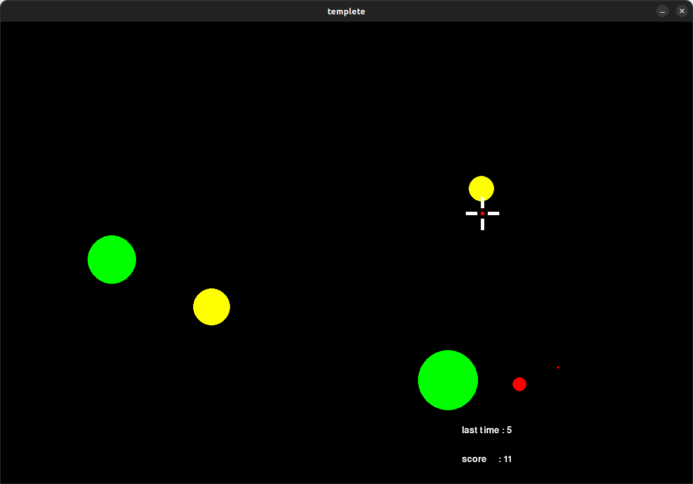

# click_game

Game A Weekの２週目の作品としてクリックゲームを作成しました。
マウスカーソルをターゲットに合わせてクリックすることで得点が加算されます。
ターゲットは時間経過とともに縮小していき、規定のサイズを下回ると消滅するため、
高得点を狙う場合には素早くカーソルを合わせることが重要となります。
なお、開発言語としてはPython、ゲーム用のライブラリとしてpygameを使用しています。

練習で作成するゲームのジャンル選定には前回と同様、「2dgames.jpのゲーム専門学校」
の「ゲームプログラミング初心者が作ると勉強になるゲーム20選」を参考にしました。

## ref
* 2dgames.jpのゲーム専門学校、ゲームプログラミング初心者が作ると勉強になるゲーム20選 
[https://www.youtube.com/watch?v=fSTa05CTB3w](https://www.youtube.com/watch?v=fSTa05CTB3w)

